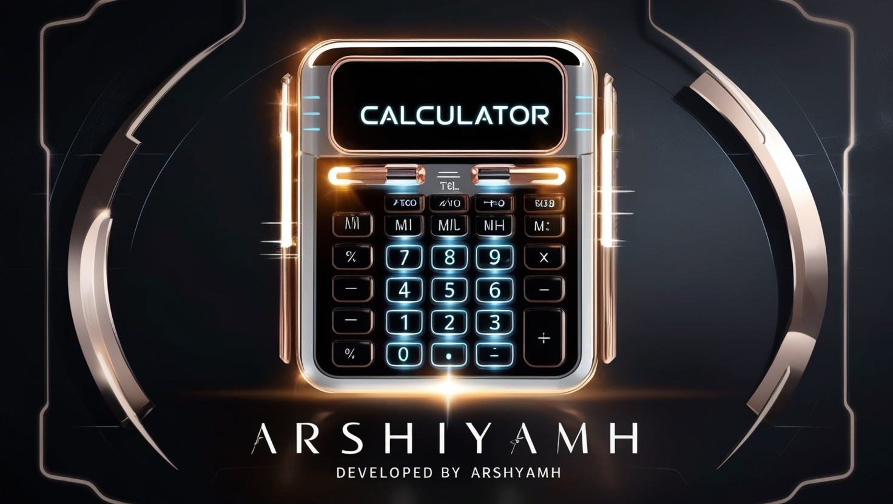

# React Calculator 🧮⚡

A sleek and interactive calculator built with React and Math.js. This simple yet efficient calculator supports real-time calculations, essential arithmetic operations, and dynamic input handling.

📌 **Features**
- ✅ **Real-time Calculations** – Instantly updates the result as you input numbers and operators
- ✅ **Dynamic Input Handling** – Manages input efficiently, including decimal points
- ✅ **Basic Arithmetic Operations** – Supports addition, subtraction, multiplication, and division
- ✅ **Minimal & Clean Design** – User-friendly interface with clear buttons and display
- ✅ **No Backend** – Frontend-only solution with all operations handled within the app

🛠️ **Technologies Used**
- React
- Math.js
- CSS

📥 **Installation & Usage**
1. Clone the repository:
    ```bash
    git clone https://github.com/arshiya-mh/Calculator 
    
    git
    ```
2. Install dependencies:
    ```bash
    npm install
    ```
3. Start the development server:
    ```bash
    npm start
    ```
4. Open your browser and go to `http://localhost:3000` to see the app in action.

🎨 **Design & Demo**
🔗 [Live Demo](https://arshiya-mh.github.io/Calculator/)

🖼️  


📜 **License**
This project is open-source and free to use.

🚀 **Developed by Arshiya MH**
